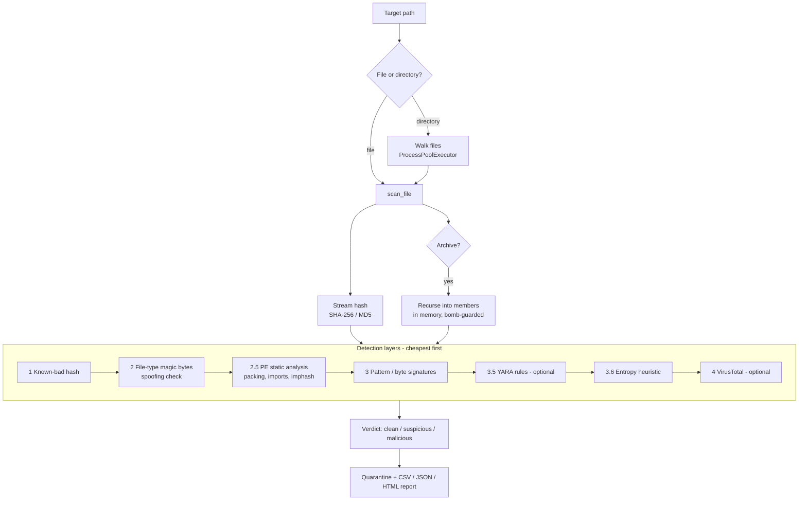

# A Layered Static Malware Scanner

**Independent Computer Science Project**
Component of the Playwright Automation Toolkit · `modules/scanner.py`, `modules/pe.py`, `modules/evaluate.py`

---

## Abstract

This project implements a working antivirus-style file scanner in Python with no
third-party dependencies for its core. It detects malicious files through seven
complementary techniques arranged as *defence in depth* — from cheap exact-hash
matching to static parsing of Windows executables — and it never executes the
files it inspects. On a labeled evaluation corpus it achieves 100% precision and
recall with zero false positives, and a parallel-scanning implementation gives a
measured 3.8× speed-up on a 4-core machine. The work doubles as a study of two
ideas that matter in real malware detection: why exact-hash signatures fail
against *variants* (addressed here with import hashing), and why Python's Global
Interpreter Lock forces a process-based — not thread-based — design for a
CPU-bound scanner.

---

## 1. Motivation

Signature-only antivirus has a well-known weakness: change a single byte and the
file's hash changes, so a brand-new hash sails past a hash blacklist. Real
detection therefore layers several independent signals, each catching what the
others miss. The goal of this project was to build a *small but genuine* version
of that layered design, to measure how well it works, and to be honest about
where it would fail.

A hard rule throughout: **the scanner only ever reads, hashes and parses files.
It never runs them.** Every "malicious" sample used in development and testing is
either the harmless [EICAR test string](https://www.eicar.org/download-anti-malware-testfile/)
or a synthetic file that merely *looks* suspicious (e.g. a `curl … | bash` line),
so the project is reproducible without handling real malware.

---

## 2. Architecture



The verdict only ever escalates (`clean → suspicious → malicious`), so the order
of layers never lowers a confirmed detection. Layers are ordered cheapest-first
so most clean files are cleared after a single hash and a magic-byte read.

### Module layout

| File | Responsibility |
|---|---|
| `modules/scanner.py` | Orchestration: hashing, the layered `_evaluate`, archive recursion, parallel walk, quarantine, reporting, CLI |
| `modules/pe.py` | Standalone static PE parser (sections, imports, entropy, imphash) |
| `modules/evaluate.py` | Labeled-corpus evaluation harness (precision / recall / F1) |
| `config/signatures.json` | Editable hash, pattern and imphash signature database |
| `rules/*.yar` | Optional YARA rules (used only if `yara-python` is installed) |
| `tests/` | 33 unit tests + a synthetic PE builder |

---

## 3. Detection layers

### 3.1 Hash signatures
SHA-256 and MD5 are streamed from the file and looked up in a known-bad table.
Exact, zero-false-positive, but defeated by a single changed byte — which
motivates every later layer.

### 3.2 File-type analysis (extension spoofing)
The file's *true* type is read from its magic bytes (`MZ`→PE, `\x7fELF`→ELF,
`%PDF`, `PK\x03\x04`→ZIP, image headers, …). A file claiming a trusted extension
(`.pdf`, `.jpg`, `.docx`) whose bytes are actually an executable is flagged
malicious — a classic delivery trick.

### 3.3 PE static analysis (`modules/pe.py`)
Windows executables are parsed directly from their bytes using `struct` — DOS
header → PE header → optional header → section table → import directory — with
full bounds checking so a malformed file yields a partial result rather than a
crash. Two signals are derived:

* **Packing.** A section with Shannon entropy ≥ 7.2 bits/byte, a section with a
  large virtual size but zero raw data, or a known packer section name (`UPX0`,
  `.aspack`, `.themida`, …) indicates the real payload is compressed/encrypted on
  disk.
* **Capability.** The imported Win32 APIs reveal intent. The analyzer groups APIs
  and escalates on dangerous *combinations*: `VirtualAllocEx` +
  `WriteProcessMemory` + `CreateRemoteThread` (process injection),
  `URLDownloadToFile` + `WinExec` (download-and-execute), plus anti-analysis and
  persistence/keylogging groups.

### 3.4 imphash — variant detection
This is the project's answer to §3.1's weakness. The
[import hash](https://www.mandiant.com/resources/blog/tracking-malware-import-hashing)
is an MD5 over the PE's `library.function` import pairs in order. Because malware
built from one source shares an import table, **two samples with different file
hashes share an imphash**, so a single signature catches a whole family. This was
verified directly (test `test_imphash_matches_variants`): two PEs with different
bytes but identical imports produce the same imphash and both match a family
signature.

### 3.5 Pattern signatures and YARA
Byte/regex indicators (embedded PE headers, `eval(base64_decode(...))`, encoded
PowerShell, `curl | bash` droppers) are scanned in the file body. If the optional
`yara-python` package is installed, `rules/*.yar` add an industry-standard rule
layer; the scanner runs unchanged when it is absent.

### 3.6 Entropy heuristic
Whole-file Shannon entropy ≥ 7.2 bits/byte flags packed/encrypted content — but
**only on risky executable extensions**. This scoping is deliberate: a
high-entropy `.bin` data file is *not* flagged, which is what keeps the false
positive rate at zero (see §5, sample `data.bin`).

### 3.7 Archive inspection
`.zip`, `.jar` and `.tar(.gz)` files are opened in memory and every member is
scanned individually, so malware hidden in an archive is caught even though
on-disk scanning never sees it. Nested archives (zip-in-zip) are scanned
recursively to a depth limit. Three bomb guards — per-member size, per-archive
total budget, and maximum nesting depth — flag rather than expand abusive
archives.

---

## 4. Evaluation methodology

A detector is only as credible as its measurement. `modules/evaluate.py` builds a
*labeled* corpus of harmless known-bad and known-good files, scans them, and
computes a confusion matrix and the standard metrics:

* **Precision** = TP / (TP + FP) — of everything flagged, how much was really bad.
* **Recall** = TP / (TP + FN) — of all threats, how many were caught.
* **F1** = harmonic mean of the two.

Treating "suspicious" or "malicious" as a positive detection, the current corpus
(13 samples) gives:

```
                 caught threats (TP) : 7
                 missed threats (FN) : 0
                 clean cleared  (TN) : 6
                 false alarms   (FP) : 0

  Precision 100.0%   Recall 100.0%   Accuracy 100.0%   F1 1.000
```

The corpus deliberately includes the adversarial-for-us case `data.bin` — 40 KB
of random bytes with a benign extension — which stays **clean**, demonstrating the
§3.6 false-positive control rather than a detector that simply flags everything
high-entropy.

> These numbers describe performance *on this corpus*. They are a sanity check
> that each layer fires and that benign files are not flagged, not a claim of
> 100% detection in the wild — see Limitations.

---

## 5. Performance: why processes, not threads

The directory walk is parallelised. The instructive part is *how*.

The first implementation used a `ThreadPoolExecutor`. It produced **no speed-up**,
even on large files. Profiling showed why: the hot path is the Shannon-entropy
calculation, which is pure-Python (`collections.Counter` + arithmetic) and so
holds the **Global Interpreter Lock**. Threads cannot run GIL-bound Python in
parallel, so they only added overhead.

Switching to a `ProcessPoolExecutor` — each worker process loads its own copy of
the signatures (the compiled YARA object cannot be pickled across the process
boundary, so it is rebuilt in the child) — gave true parallelism:

| Workload (40 × 3 MB files) | Workers | Time | Speed-up |
|---|---|---|---|
| Serial | 1 | 13.90 s | 1.0× |
| Parallel | 4 (= cores) | 3.62 s | **3.8×** |

VirusTotal lookups are kept serial regardless, because they are network-bound and
rate-limited; and small jobs run inline to avoid process-startup overhead. The
takeaway — *thread vs process choice follows from whether the bottleneck releases
the GIL* — generalises well beyond this project.

---

## 6. Testing

33 unit tests (`python -m unittest discover -s tests`) cover every layer in
isolation: entropy maths, signature loading, hash/pattern/entropy detection,
extension spoofing, PE packing and import-combo detection, imphash variant
matching, single- and nested-archive scanning, zip-bomb guards, quarantine,
report generation, CLI exit codes, and parallel-vs-serial agreement. A synthetic
PE builder (`tests/pefix.py`) constructs well-formed PE bytes with chosen sections
and import tables, so the analyzer is exercised without shipping real
executables. The suite passes both with and without the optional `yara-python`
dependency installed (the YARA-specific test self-skips when absent).

---

## 7. Limitations

* **Static only.** No sandboxing or dynamic/behavioural analysis, so packers that
  fully encrypt their payload are flagged as *suspicious* (via entropy) but their
  unpacked behaviour is never observed.
* **Small signature set.** The bundled database is illustrative. In production
  these feeds come from threat-intelligence sharing and contain millions of
  entries.
* **PE-centric.** The deepest analysis targets Windows PE files; ELF and Mach-O
  are identified but not deeply parsed.
* **Corpus size.** The evaluation corpus is small and self-authored; the 100%
  figures validate the plumbing, not real-world detection rates.

---

## 8. Future work

* Dynamic analysis in a sandbox to observe unpacked behaviour.
* A fuzzy/similarity hash (e.g. ssdeep/TLSH) for non-PE variant clustering.
* An ELF/Mach-O analyzer mirroring `modules/pe.py`.
* A pull-based importer for an open threat-intel hash feed.
* A larger, third-party labeled corpus for honest detection-rate numbers.

---

## 9. How to run

```bash
pip install -r requirements.txt            # core deps; yara-python optional
python main.py scan ~/Downloads            # non-interactive scan (exit 1 if malicious)
python main.py eval                        # print the metrics table above
python -m unittest discover -s tests -v    # 33 tests
```

A styled HTML report is written to `output/logs/scan_*.html` after every scan.

---

## References

1. EICAR Standard Anti-Virus Test File — https://www.eicar.org
2. Mandiant, *Tracking Malware with Import Hashing* (imphash).
3. Microsoft, *PE Format* specification (PE/COFF headers, import directory).
4. YARA — *The pattern matching swiss knife for malware researchers*.
5. C. Shannon, "A Mathematical Theory of Communication" (entropy).
